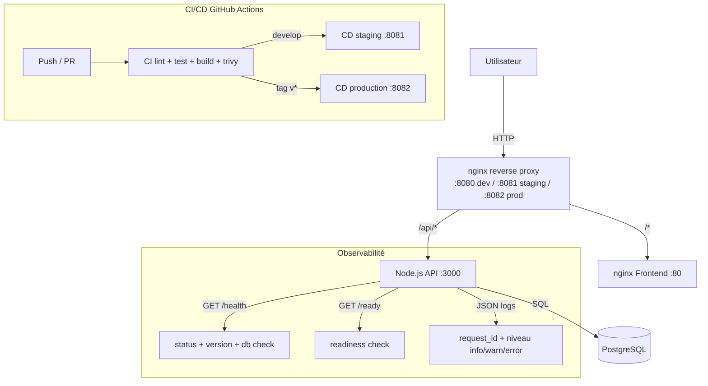

# Architecture — ShopLite

## Diagramme



## Services

| Service | Image | Port interne | Port exposé (dev) |
|---|---|---|---|
| proxy | nginx:1.27-alpine | 80 | 8080 |
| api | shoplite-api | 3000 | — |
| frontend | shoplite-frontend | 80 | — |
| db | postgres:16-alpine | 5432 | — |

## Flux de déploiement

```
feature/* → CI (lint + test + build)
develop   → CI + CD staging  (port 8081, automatique)
tag v*    → CI + CD production (port 8082, approbation manuelle)
```

## Volumes

- `shoplite_pgdata` — données PostgreSQL dev
- `shoplite_pgdata_staging` — données PostgreSQL staging
- `./backups/` — dumps SQL horodatés (rétention 7 jours)

## Logs en production

Les logs JSON seraient centralisés via **Loki + Grafana** ou **ELK**, en récupérant les logs Docker avec le driver `json-file`.
